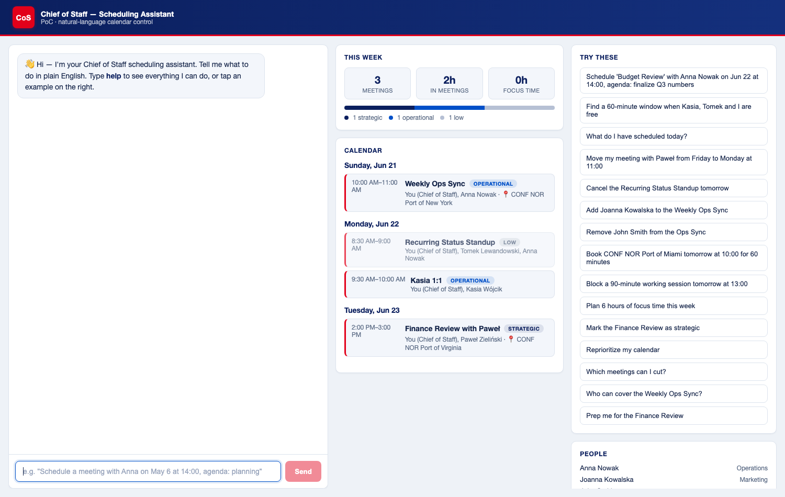

# Chief of Staff — Scheduling Assistant

**Manage your calendar in plain English.** Type a command — *"Schedule a budget
review with Anna on Friday at 2pm"* — and it creates, reschedules, cancels, and
reasons about meetings on a live calendar, flagging conflicts, holidays, buffer
time, and time-zone differences as it goes.

### ▶ Live demo: **https://cos-scheduler.onrender.com**
*(Free hosting — the first load may take ~30–60s to wake up, then it's instant.)*



**Try these in the chat** (or tap them in the sidebar):
- `Schedule 'Budget Review' with Anna Nowak on Jun 22 at 14:00, agenda: finalize Q3 numbers`
- `Find a 60-minute window when Kasia, Tomek and I are free`
- `Move my meeting with Paweł from Friday to Monday at 11:00`
- `Plan 6 hours of focus time this week`
- `Which meetings can I cut?` · `Prep me for the Finance Review`

A natural-language scheduling assistant: chat + live calendar UI, a calendar
reasoning engine, **PostgreSQL** persistence, and an optional **Microsoft Outlook
(Graph)** bridge.

---

## Approach

The core idea is a **natural-language layer over a calendar**: the user types a
sentence, and the system turns it into a structured action, applies the
scheduling rules, saves it, and replies in chat. One sentence in → a calendar
change + a human reply out.

**Every command follows the same four-step pipeline on the backend:**

1. **Understand** (`nlp.ts`) — a rule-based parser reads the sentence and pulls
   out the **intent** (create / cancel / reschedule / review…) and the
   **entities** (who, what date & time, how long, which room). It outputs one
   clean structured object, a `ParsedCommand`.
2. **Execute** (`assistant.ts` + `scheduler.ts`) — the business rules run on that
   object: check required fields, detect conflicts, warn about holidays / buffers
   / time-zones, search for free slots, book rooms.
3. **Persist** (`store.ts` + `db.ts`) — the change is written to **PostgreSQL**,
   the source of truth.
4. **Reply** — it returns a chat message plus the updated calendar, and the UI
   re-renders.

**Why it's built this way (the design decisions):**

- **Rule-based parsing, not an LLM.** For scheduling, *explainable and
  deterministic* beats *clever* — it never hallucinates a date, runs offline,
  costs nothing, and is easy to test. Because step 1 outputs a clean
  `ParsedCommand`, an LLM can be dropped in later without touching the business
  logic.
- **The database is the source of truth, with an in-memory working copy.** The
  engine reads the calendar many times per command, so rather than make every
  function `async`, the app **loads the calendar into memory at startup** and
  **writes each change back to Postgres.** State survives restarts; the code
  stays simple and synchronous.
- **One endpoint, thin frontend.** Everything goes through a single
  `POST /api/command`. The React app just sends text and renders the reply — all
  the intelligence lives server-side.
- **Business rules live in one place** (`assistant.ts` / `scheduler.ts`), so
  conflicts, holidays, buffers, and time-zones behave consistently across every
  command.
- **Outlook is mocked, but the real bridge is built.** It emits realistic
  invite / update / cancellation notices where a real Microsoft Graph call would
  go, so the demo runs offline — and the actual integration is included and can
  be switched on.

> **In one line:** it parses plain English into a structured command, runs it
> through a calendar-reasoning engine that enforces the scheduling rules,
> persists the result to Postgres, and replies in chat — with the language layer
> deliberately kept simple and swappable.

---

## Stack

- **Backend** — Node + Express + TypeScript. **Postgres** for persistence, a
  dependency-free rule-based NLP parser, a calendar reasoning engine, and an
  optional Microsoft Graph integration (`@azure/msal-node`).
- **Frontend** — React + Vite + TypeScript. Chat panel, live calendar, directory
  & holiday sidebar, Outlook connect/status. Reads and writes everything through
  the backend API — it never touches Postgres or Microsoft directly (no
  credentials in the browser).
- **Database** — Postgres (`cos_scheduler`). Tables: `users`, `rooms`,
  `holidays`, `emails`, `files`, `events`, `app_state`.
- **Outlook (optional)** — Microsoft Graph via delegated OAuth. When connected,
  meeting create / reschedule / cancel / attendee changes mirror to a real
  Outlook calendar and Outlook sends the invitation/update/cancellation emails.
  When not connected, the app runs in **mock mode** (everything works; nothing is
  written to a real calendar).

---

## Prerequisites

A running Postgres (Postgres 16 tested). On macOS:

```bash
brew install postgresql@16
brew services start postgresql@16
```

## Run it

The folder names contain spaces, so keep the quotes:

```bash
# 1. backend deps + database (creates the DB, applies the schema, seeds demo data)
cd "scheduling-app/Scheduling app backend"
npm install
npm run db:setup          # one-time (re-run any time to reset demo data)
npm run dev               # → http://localhost:4100  (postgres-backed)

# 2. frontend → http://localhost:5173
cd "scheduling-app/Scheduling app frontend"
npm install
npm run dev
```

Open <http://localhost:5173> and type `help`, or tap an example on the right.

### Database config

The backend reads `DATABASE_URL` (see `Scheduling app backend/.env.example`). The
default — `postgresql://<your-os-user>@localhost:5432/cos_scheduler` — works on a
stock Homebrew install with no password. Override it via a `.env` file or the
environment if your setup differs.

- `npm run db:setup` — create the database (if missing), apply the schema, and
  load demo data. **Re-running wipes data you created** and refreshes the
  today-relative sample events.
- Schema upgrades are applied automatically at boot (`migrate()`), so existing
  databases pick up new columns/tables without a data-wiping re-seed.

### Connect a real Outlook calendar (optional)

By default the app runs in **mock mode** — the top bar shows *"Outlook: mock
mode"* and nothing is written to a real calendar. To go live, register a
Microsoft Entra app, drop the `MS_*` values into `.env`, restart, and click
**Connect Outlook**. Full step-by-step: **[Scheduling app backend/OUTLOOK_SETUP.md](Scheduling%20app%20backend/OUTLOOK_SETUP.md)**.

---

## Capabilities (mapped to the spec)

All commands below work today.

| Capability | Example command |
|---|---|
| Create a meeting | `Schedule 'Budget Review' with Anna Nowak on Jun 22 at 14:00, agenda: finalize Q3 numbers` |
| Check availability | `Find a 60-minute window when Kasia, Tomek and I are free` |
| Reschedule | `Move my meeting with Paweł from Friday to Monday at 11:00` |
| Cancel | `Cancel the Recurring Status Standup tomorrow` |
| Add participant | `Add Joanna Kowalska to the Weekly Ops Sync` |
| Remove participant (ambiguity) | `Remove John Smith Team A from the Ops Sync` (asks Team A vs Team B if unqualified) |
| Review calendar | `What do I have scheduled today?` / `Show all my meetings this week` |
| Minimum required fields | Creating without title/agenda/time → assistant prompts for them |
| Scheduling conflict | Booking over an existing event → warns + suggests alternatives |
| Working session | `Block a 90-minute working session tomorrow at 13:00` |
| Holiday conflicts (US/HO) | Scheduling on a holiday → warns (US federal + Home Office) |
| Book a meeting room | `Book CONF NOR Port of Miami tomorrow at 10:00 for 60 minutes` |
| Buffer / focus time | Back-to-back bookings → buffer warning |
| Focus plan | `Plan 6 hours of focus time this week` → proposes deep-work blocks |
| Set priority | `Mark the Finance Review as strategic` → updates the meeting's priority |
| Reprioritize | `Reprioritize my calendar` → ranks meetings strategic → low |
| Time-zone conversion | Cross-time-zone attendees → start time shown in each local zone |
| Auto-delegate | `Who can cover the Weekly Ops Sync?` → suggests delegate + draft note |
| Meeting prep builder | `Prep me for the Finance Review` → 1-page summary with recent emails + files |
| Filler-meeting analyzer | `Which meetings can I cut?` → flags low-impact meetings |

Type `help` in the chat for the full list.

---

## Project structure & key files

```
scheduling-app/
├─ README.md                     ← you are here
├─ Scheduling app backend/       ← Express + Postgres + Graph API
└─ Scheduling app frontend/      ← React + Vite UI
```

### Backend — `Scheduling app backend/src/`

| File | What it does |
|---|---|
| **[index.ts](Scheduling%20app%20backend/src/index.ts)** | Express server & wiring. Routes: `GET /api/health`, `/api/directory`, `/api/events`, `POST /api/command` (the single conversational endpoint), and the Outlook auth routes `/api/auth/{login,callback,status,logout}`. On boot: `migrate()` → `hydrate()` → `listen()`. After any event-mutating command it mirrors the change to Outlook (`syncToOutlook`) and persists. |
| **[nlp.ts](Scheduling%20app%20backend/src/nlp.ts)** | Rule-based natural-language parser. Turns text into a `ParsedCommand` (intent + entities: dates/times incl. abbreviated months, people, duration, title, agenda, room, priority, focus-goal). No LLM — explainable and offline. |
| **[assistant.ts](Scheduling%20app%20backend/src/assistant.ts)** | Business logic. One handler per intent (create, availability, reschedule, cancel, add/remove participant, review, working session, book room, delegate, prep, filler, set priority, reprioritize, focus plan). Applies minimum-required-fields, conflict, holiday, buffer, and time-zone rules and builds the chat reply. |
| **[scheduler.ts](Scheduling%20app%20backend/src/scheduler.ts)** | Calendar reasoning engine. Conflict & room-clash detection, free-slot search, holiday checks, buffer warnings, filler analysis, delegate suggestion, and the prep-summary builder (pulls relevant emails/files by tag + attendee). |
| **[store.ts](Scheduling%20app%20backend/src/store.ts)** | In-memory working set backed by Postgres. `hydrate()` loads all tables into memory at boot; `persistEvents()` upserts event changes back after each command. Source of truth is Postgres; the arrays are a request-time cache. |
| **[db.ts](Scheduling%20app%20backend/src/db.ts)** | Postgres connection pool (`DATABASE_URL`), `migrate()` (idempotent schema upgrades), and `getState`/`setState` for the `app_state` key/value table. |
| **[schema.sql](Scheduling%20app%20backend/src/schema.sql)** | Canonical DDL for all tables (people, rooms, holidays, emails, files, events, app_state). |
| **[seedData.ts](Scheduling%20app%20backend/src/seedData.ts)** | Demo data: directory, rooms, 2026 holidays, mock emails/files, and today-relative sample events. |
| **[seed.ts](Scheduling%20app%20backend/src/seed.ts)** | `npm run db:setup` script — creates the DB if missing, applies the schema, truncates, and loads `seedData`. |
| **[graph.ts](Scheduling%20app%20backend/src/graph.ts)** | Microsoft Graph / Outlook integration. MSAL delegated OAuth (auth-code flow), token cache persisted in Postgres (`app_state`), and `create`/`update`/`cancel` Outlook event helpers. All no-ops in mock mode. |
| **[types.ts](Scheduling%20app%20backend/src/types.ts)** | Shared domain types (`User`, `Room`, `Holiday`, `CalendarEvent`, …). |
| **[OUTLOOK_SETUP.md](Scheduling%20app%20backend/OUTLOOK_SETUP.md)** · **[.env.example](Scheduling%20app%20backend/.env.example)** | Outlook connection guide and config template. |

### Frontend — `Scheduling app frontend/src/`

| File | What it does |
|---|---|
| **[App.tsx](Scheduling%20app%20frontend/src/App.tsx)** | Top-level UI: chat + live calendar + sidebar (examples, people, rooms, holidays). Dispatches commands, refreshes the calendar on mutations, and shows the Outlook connect/status control in the top bar. |
| **[api.ts](Scheduling%20app%20frontend/src/api.ts)** | Typed API client (`directory`, `events`, `command`, `authStatus`, `logout`) and shared response types. |
| **[components/Chat.tsx](Scheduling%20app%20frontend/src/components/Chat.tsx)** | Chat transcript + composer (minimal markdown rendering). |
| **[components/CalendarPanel.tsx](Scheduling%20app%20frontend/src/components/CalendarPanel.tsx)** | Live calendar grouped by day with holiday markers and priority pills. |
| **[styles.css](Scheduling%20app%20frontend/src/styles.css)** · **[main.tsx](Scheduling%20app%20frontend/src/main.tsx)** | Styling and React entry point. |

---

## How it works

```
frontend  ──POST /api/command { text }──▶  backend
                                            ├─ nlp.ts        parse intent + entities (dates, people, duration, room, priority)
                                            ├─ assistant.ts  apply business rules, mutate the working set, build reply
                                            ├─ scheduler.ts  availability search, conflicts, holidays, analyses
                                            ├─ store.ts ─▶ Postgres (db.ts)     persist the change
                                            └─ graph.ts ─▶ Microsoft Graph      mirror to Outlook + notify (if connected)
```

**Per command:** `parse → execute → persist → sync → reply`.

- **Postgres is the durable source of truth.** Because the reasoning engine is
  synchronous and reads the event set many times per command, `store.ts` keeps an
  in-memory working set **hydrated from Postgres at startup** and **written
  through on every mutation** — so state survives restarts without making the
  whole engine async. Reference data (people, rooms, holidays, mock emails/files)
  is read-only at runtime and loaded once.
- **Outlook is a best-effort mirror.** When connected, `index.ts` calls
  `graph.ts` after the local change is applied. A Graph failure is reported in
  the chat but never rolls back the command — the local DB stays authoritative.
- **The parser is rule-based and explainable** (no LLM call) so the PoC runs
  offline. To upgrade, swap `parseCommand` for an LLM call returning the same
  `ParsedCommand` shape — `assistant.ts` is unchanged.

---

## Implementation notes — what's been built

The PoC was delivered in three phases.

### 1. Spec completion & bug fixes (reasoning engine)
- **Abbreviated-month dates** — `Jun 22`, `Dec 25`, `Jul 1` now parse correctly
  (previously only full names + "May" worked; others silently fell to today).
- **`set_priority`**, **`reprioritize`**, **`focus_plan`** — these intents were
  declared but unhandled; now fully implemented.
- **Prep-builder** now pulls relevant recent emails and files by tag + attendee
  (was a generic stub).
- **Time-zone conversion** — meetings with attendees in other zones show each
  local start time.
- Plus delegate-handover formatting, help text, frontend examples, and corrected
  root scripts/paths.

### 2. Postgres persistence
- Replaced the in-memory store with Postgres: `schema.sql`, `db.ts`, `seedData.ts`,
  `seed.ts`, and a rewritten `store.ts` (`hydrate` + `persistEvents`).
- `npm run db:setup` provisions the `cos_scheduler` database and demo data;
  idempotent `migrate()` upgrades existing databases at boot.
- Verified: create an event, restart the backend, and it persists.

### 3. Microsoft Outlook (Graph) integration
- `graph.ts` (MSAL delegated auth + Graph create/update/cancel), auth routes in
  `index.ts`, an `outlook_event_id` column, a Postgres-backed token cache
  (`app_state`), and a **Connect Outlook** control in the UI.
- Optional and **fails safe**: with no `MS_*` credentials the app runs in mock
  mode. See **[OUTLOOK_SETUP.md](Scheduling%20app%20backend/OUTLOOK_SETUP.md)** to go live.

---

## Notes & limitations

- **Stateless conversation.** Each command is parsed independently — the
  assistant doesn't remember a prior question. To disambiguate a duplicate name,
  put the qualifier in the command itself (`Add John Smith Team A to …`) rather
  than replying "Team A" on its own line.
- **Demo emails are placeholders.** Attendees use `@example.com` addresses, so
  real Outlook invitations to them will bounce. For a live invite test, edit a
  user's email in `seedData.ts` to an inbox you control and re-run `npm run db:setup`.
- **Availability uses the local calendar**, not real Outlook free/busy (reading
  others' calendars would require additional Graph permissions).
